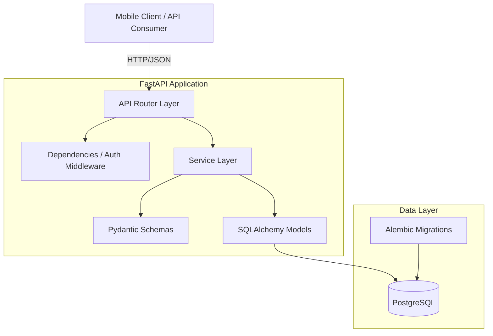
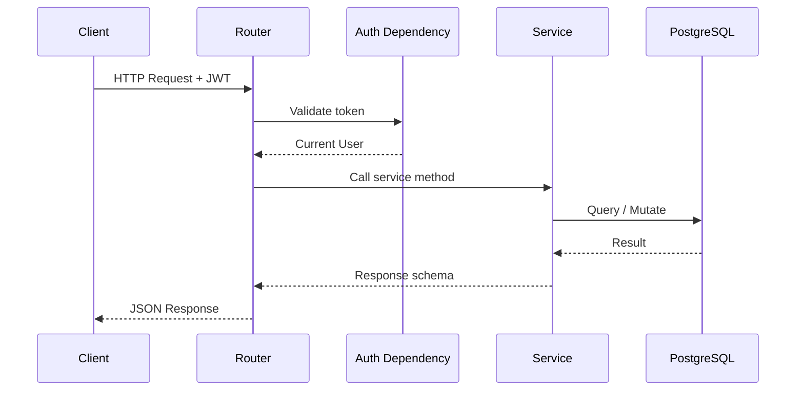
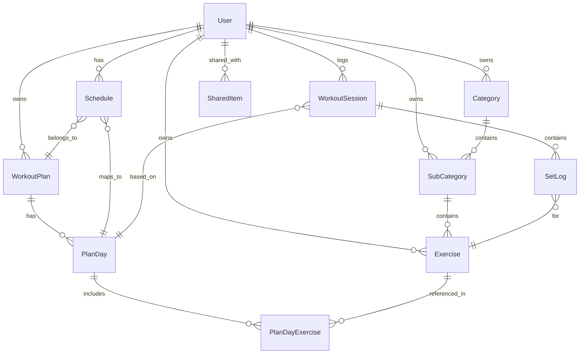

# Design Document: GoGym MVP Backend API

## Overview

GoGym MVP Backend is a RESTful API built with Python FastAPI that powers a mobile-first workout planning, scheduling, and logging application. The API provides user authentication, a hierarchical workout inventory (Categories → Sub-Categories → Exercises), workout plan creation with multi-day structures, calendar-based scheduling, session logging with weight tracking, sharing with approval workflows, and workout history with progress tracking.

The system supports two roles: Admin (manages global curated content) and User (manages personal content, logs workouts). Content visibility is controlled via a sharing_scope model (private, shared, global) with an admin approval queue for user-submitted global content.

### Key Design Decisions

1. **Layered architecture**: Routes → Services → Repository/ORM pattern to keep business logic testable and separate from HTTP concerns.
2. **Pydantic v2 schemas**: Request/response validation with snake_case JSON serialization, leveraging FastAPI's native integration.
3. **SQLAlchemy 2.0 style**: Using mapped_column and modern async-compatible patterns for the ORM layer.
4. **Alembic autogenerate**: Migration scripts generated from model changes to keep schema and code in sync.
5. **Ownership-based access control**: Every mutable resource checks owner_id against the authenticated user, with Admin bypass for global content.
6. **Soft-delete not used in MVP**: Hard deletes with cascade for simplicity. Soft-delete can be added later.

## Architecture

### System Architecture Diagram



### Request Flow



### Project Structure

```
gogym-api/
├── alembic/
│   ├── versions/          # Migration scripts
│   ├── env.py
│   └── alembic.ini
├── app/
│   ├── __init__.py
│   ├── main.py            # FastAPI app factory, lifespan events
│   ├── config.py          # Settings from env vars / .env
│   ├── database.py        # Engine, SessionLocal, Base
│   ├── dependencies.py    # get_db, get_current_user, require_admin
│   ├── models/
│   │   ├── __init__.py
│   │   ├── user.py
│   │   ├── inventory.py   # Category, SubCategory, Exercise
│   │   ├── plan.py        # WorkoutPlan, PlanDay, PlanDayExercise
│   │   ├── schedule.py
│   │   ├── session.py     # WorkoutSession, SetLog
│   │   └── sharing.py     # SharedItem (many-to-many for shared access)
│   ├── schemas/
│   │   ├── __init__.py
│   │   ├── auth.py
│   │   ├── inventory.py
│   │   ├── plan.py
│   │   ├── schedule.py
│   │   ├── session.py
│   │   └── sharing.py
│   ├── services/
│   │   ├── __init__.py
│   │   ├── auth.py
│   │   ├── inventory.py
│   │   ├── plan.py
│   │   ├── schedule.py
│   │   ├── session.py
│   │   └── sharing.py
│   └── routes/
│       ├── __init__.py
│       ├── auth.py
│       ├── inventory.py
│       ├── plan.py
│       ├── schedule.py
│       ├── session.py
│       └── sharing.py
├── tests/
│   ├── conftest.py        # Fixtures: test DB, client, auth helpers
│   ├── test_auth.py
│   ├── test_inventory.py
│   ├── test_plan.py
│   ├── test_schedule.py
│   ├── test_session.py
│   └── test_sharing.py
├── .env.example
├── requirements.txt
├── pyproject.toml
└── README.md
```


## Components and Interfaces

### 1. Configuration (`app/config.py`)

Uses Pydantic `BaseSettings` to load from environment variables / `.env`:

```python
class Settings(BaseSettings):
    database_url: str                    # PostgreSQL connection string
    jwt_secret: str                      # Secret key for JWT signing
    jwt_algorithm: str = "HS256"
    access_token_expire_minutes: int = 60
    
    model_config = SettingsConfigDict(env_file=".env")
```

### 2. Database (`app/database.py`)

- Creates SQLAlchemy `engine` and `SessionLocal` factory from `Settings.database_url`.
- Provides `Base` declarative base for all models.
- Lifespan event in `main.py` verifies DB connectivity on startup (Requirement 1.5).

### 3. Authentication Dependencies (`app/dependencies.py`)

| Dependency | Purpose |
|---|---|
| `get_db()` | Yields a DB session per request, commits/rollbacks automatically |
| `get_current_user(token)` | Decodes JWT, fetches User from DB, raises 401 if invalid |
| `require_admin(user)` | Raises 403 if `user.role != "admin"` |

### 4. Routes Layer (`app/routes/`)

Each route module registers an `APIRouter` with a prefix:

| Module | Prefix | Key Endpoints |
|---|---|---|
| `auth.py` | `/auth` | `POST /register`, `POST /login` |
| `inventory.py` | `/inventory` | CRUD for categories, sub-categories, exercises. Admin and user variants. |
| `plan.py` | `/plans` | CRUD for workout plans and plan days |
| `schedule.py` | `/schedule` | Assign plans to dates, get daily workout |
| `session.py` | `/sessions` | Start session, log sets, complete session, get history |
| `sharing.py` | `/sharing` | Share items, submit for approval, admin approval queue |

### 5. Service Layer (`app/services/`)

Business logic lives here. Services receive a DB session and validated schema objects, perform authorization checks, execute queries, and return response schemas. This keeps routes thin.

Key service responsibilities:
- **AuthService**: Password hashing (bcrypt), JWT creation/validation, user registration with duplicate check.
- **InventoryService**: CRUD with ownership checks, visibility filtering (global + user's own + shared-with-user).
- **PlanService**: Plan CRUD with cascading plan days and exercises, same visibility model.
- **ScheduleService**: Date-range assignment with conflict detection (409), daily workout retrieval.
- **SessionService**: Session lifecycle (start → log sets → complete/end early), previous performance lookup, history with pagination.
- **SharingService**: Share-by-email, submit-for-approval, admin approve/reject, approval queue filtering.

### 6. API Endpoint Details

#### Auth Endpoints

```
POST /auth/register
  Request:  { email, password, name }
  Response: { access_token, token_type, user: { id, email, name, role } }
  Errors:   409 (duplicate email), 422 (validation)

POST /auth/login
  Request:  { email, password }
  Response: { access_token, token_type, user: { id, email, name, role } }
  Errors:   401 (bad credentials), 422 (validation)
```

#### Inventory Endpoints

```
GET    /inventory/categories                    # List all visible categories
POST   /inventory/categories                    # Create category (user=private, admin=global)
PUT    /inventory/categories/{id}               # Update own or admin
DELETE /inventory/categories/{id}               # Delete own or admin (cascades)

GET    /inventory/categories/{id}/subcategories # List sub-categories
POST   /inventory/categories/{id}/subcategories # Create sub-category
PUT    /inventory/subcategories/{id}            # Update
DELETE /inventory/subcategories/{id}            # Delete (cascades)

GET    /inventory/subcategories/{id}/exercises  # List exercises
POST   /inventory/subcategories/{id}/exercises  # Create exercise
PUT    /inventory/exercises/{id}                # Update
DELETE /inventory/exercises/{id}                # Delete
```

#### Plan Endpoints

```
GET    /plans                          # List all visible plans
POST   /plans                          # Create plan
GET    /plans/{id}                     # Get plan with days
PUT    /plans/{id}                     # Update plan
DELETE /plans/{id}                     # Delete plan (cascades)

POST   /plans/{id}/days                # Add plan day
PUT    /plans/{plan_id}/days/{day_id}  # Update plan day
DELETE /plans/{plan_id}/days/{day_id}  # Delete plan day

POST   /plans/days/{day_id}/exercises  # Add exercise to day
PUT    /plans/day-exercises/{id}       # Update exercise assignment
DELETE /plans/day-exercises/{id}       # Remove exercise from day
```

#### Schedule Endpoints

```
GET    /schedule?start_date=&end_date=  # Get schedule for date range
POST   /schedule                        # Assign plan day to date
POST   /schedule/plan                   # Assign full plan to date range
PUT    /schedule/{id}                   # Update schedule entry
DELETE /schedule/{id}                   # Remove schedule entry

GET    /schedule/today                  # Get today's workout (Req 11)
GET    /schedule/days/{day_id}          # Get plan day detail
```

#### Session Endpoints

```
POST   /sessions                        # Start workout session
POST   /sessions/{id}/sets              # Log a set
PUT    /sessions/{id}/complete          # Mark session complete
PUT    /sessions/{id}/end               # End session early (partial)
GET    /sessions                        # Workout history (paginated)
GET    /sessions/{id}                   # Session detail
GET    /sessions/exercises/{id}/history # Exercise progress/weight history
GET    /sessions/exercises/{id}/previous # Previous performance for exercise
```

#### Sharing Endpoints

```
POST   /sharing/items/{id}/share        # Share with specific users
POST   /sharing/items/{id}/submit       # Submit for global approval
GET    /sharing/approval-queue           # Admin: list pending items
PUT    /sharing/approval-queue/{id}      # Admin: approve or reject
```


## Data Models

### Entity Relationship Diagram



### Model Definitions

#### User

| Column | Type | Constraints |
|---|---|---|
| id | UUID | PK, default uuid4 |
| email | String(255) | Unique, Not Null, Indexed |
| hashed_password | String(255) | Not Null |
| name | String(100) | Not Null |
| role | Enum("user", "admin") | Not Null, Default "user" |
| created_at | DateTime | Not Null, Default now |
| updated_at | DateTime | Not Null, Default now, On update now |

#### Category

| Column | Type | Constraints |
|---|---|---|
| id | UUID | PK |
| name | String(100) | Not Null |
| owner_id | UUID | FK → User.id, Nullable (null for seed data) |
| sharing_scope | Enum("private", "shared", "global") | Not Null, Default "private" |
| approval_status | Enum("pending", "approved", "rejected") | Nullable |
| created_at | DateTime | Not Null |
| updated_at | DateTime | Not Null |

#### SubCategory

| Column | Type | Constraints |
|---|---|---|
| id | UUID | PK |
| name | String(100) | Not Null |
| category_id | UUID | FK → Category.id, Not Null |
| owner_id | UUID | FK → User.id, Nullable |
| sharing_scope | Enum | Not Null, Default "private" |
| approval_status | Enum | Nullable |
| created_at | DateTime | Not Null |
| updated_at | DateTime | Not Null |

#### Exercise

| Column | Type | Constraints |
|---|---|---|
| id | UUID | PK |
| name | String(150) | Not Null |
| description | Text | Nullable |
| target_muscles | String(255) | Nullable |
| subcategory_id | UUID | FK → SubCategory.id, Not Null |
| owner_id | UUID | FK → User.id, Nullable |
| sharing_scope | Enum | Not Null, Default "private" |
| approval_status | Enum | Nullable |
| created_at | DateTime | Not Null |
| updated_at | DateTime | Not Null |

#### WorkoutPlan

| Column | Type | Constraints |
|---|---|---|
| id | UUID | PK |
| name | String(150) | Not Null |
| description | Text | Nullable |
| num_days | Integer | Not Null |
| owner_id | UUID | FK → User.id, Nullable |
| sharing_scope | Enum | Not Null, Default "private" |
| approval_status | Enum | Nullable |
| created_at | DateTime | Not Null |
| updated_at | DateTime | Not Null |

#### PlanDay

| Column | Type | Constraints |
|---|---|---|
| id | UUID | PK |
| plan_id | UUID | FK → WorkoutPlan.id, Not Null |
| day_number | Integer | Not Null |
| name | String(100) | Nullable (e.g., "Push Day") |
| created_at | DateTime | Not Null |
| updated_at | DateTime | Not Null |

Unique constraint: `(plan_id, day_number)`

#### PlanDayExercise

| Column | Type | Constraints |
|---|---|---|
| id | UUID | PK |
| plan_day_id | UUID | FK → PlanDay.id, Not Null |
| exercise_id | UUID | FK → Exercise.id, Not Null |
| display_order | Integer | Not Null |
| prescribed_sets | Integer | Not Null |
| prescribed_reps | Integer | Not Null |
| created_at | DateTime | Not Null |
| updated_at | DateTime | Not Null |

Unique constraint: `(plan_day_id, display_order)`

#### Schedule

| Column | Type | Constraints |
|---|---|---|
| id | UUID | PK |
| user_id | UUID | FK → User.id, Not Null |
| plan_day_id | UUID | FK → PlanDay.id, Not Null |
| plan_id | UUID | FK → WorkoutPlan.id, Not Null |
| scheduled_date | Date | Not Null |
| created_at | DateTime | Not Null |
| updated_at | DateTime | Not Null |

Unique constraint: `(user_id, scheduled_date)` — enforces one workout per day per user (Req 10.5).

#### WorkoutSession

| Column | Type | Constraints |
|---|---|---|
| id | UUID | PK |
| user_id | UUID | FK → User.id, Not Null |
| plan_day_id | UUID | FK → PlanDay.id, Not Null |
| session_date | Date | Not Null |
| status | Enum("in_progress", "completed", "partial") | Not Null, Default "in_progress" |
| started_at | DateTime | Not Null |
| completed_at | DateTime | Nullable |
| created_at | DateTime | Not Null |
| updated_at | DateTime | Not Null |

#### SetLog

| Column | Type | Constraints |
|---|---|---|
| id | UUID | PK |
| session_id | UUID | FK → WorkoutSession.id, Not Null |
| exercise_id | UUID | FK → Exercise.id, Not Null |
| set_number | Integer | Not Null |
| reps_performed | Integer | Not Null |
| weight | Decimal(7,2) | Not Null, Check > 0 |
| created_at | DateTime | Not Null |

Unique constraint: `(session_id, exercise_id, set_number)`

#### SharedItem

| Column | Type | Constraints |
|---|---|---|
| id | UUID | PK |
| item_type | Enum("category", "subcategory", "exercise", "workout_plan") | Not Null |
| item_id | UUID | Not Null |
| shared_with_user_id | UUID | FK → User.id, Not Null |
| shared_by_user_id | UUID | FK → User.id, Not Null |
| created_at | DateTime | Not Null |

Unique constraint: `(item_type, item_id, shared_with_user_id)`

### Cascade Delete Rules

| Parent | Child | On Delete |
|---|---|---|
| Category | SubCategory | CASCADE |
| SubCategory | Exercise | CASCADE |
| WorkoutPlan | PlanDay | CASCADE |
| PlanDay | PlanDayExercise | CASCADE |
| WorkoutSession | SetLog | CASCADE |


## Correctness Properties

*A property is a characteristic or behavior that should hold true across all valid executions of a system — essentially, a formal statement about what the system should do. Properties serve as the bridge between human-readable specifications and machine-verifiable correctness guarantees.*

### Property 1: Authentication round-trip

*For any* valid registration input (email, password, name), registering a user and then logging in with the same email and password should return a valid JWT access token that decodes to the registered user's identity.

**Validates: Requirements 2.1, 2.2**

### Property 2: Duplicate email rejection

*For any* already-registered email address, attempting to register again with that email should return a 409 Conflict response, and the total user count should remain unchanged.

**Validates: Requirements 2.3**

### Property 3: Invalid credentials rejection

*For any* registered user, attempting to login with an incorrect password should return a 401 Unauthorized response and no token should be issued.

**Validates: Requirements 2.4**

### Property 4: Unauthenticated access rejection

*For any* protected API endpoint, a request without a valid JWT token (missing, expired, or malformed) should return a 401 Unauthorized response.

**Validates: Requirements 2.5**

### Property 5: Non-admin role rejection

*For any* admin-only endpoint and any authenticated user with role "user", the request should return a 403 Forbidden response.

**Validates: Requirements 2.6**

### Property 6: JWT expiration configuration

*For any* configured `access_token_expire_minutes` value, the issued JWT token's `exp` claim should equal the issued-at time plus the configured minutes.

**Validates: Requirements 2.8, 17.2**

### Property 7: Referential integrity enforcement

*For any* child model (SubCategory, Exercise, PlanDay, PlanDayExercise, Schedule, SetLog), attempting to create a record with a non-existent parent foreign key should raise an integrity error and the record should not be persisted.

**Validates: Requirements 3.2, 16.2**

### Property 8: Model field invariants

*For any* newly created model instance, `created_at` and `updated_at` should be non-null. Additionally, for any Category, SubCategory, Exercise, or WorkoutPlan instance, `sharing_scope` and `owner_id` fields should be present and consistent with the creator's role.

**Validates: Requirements 3.3, 3.5**

### Property 9: Admin-created resources have global scope

*For any* Category, SubCategory, Exercise, or WorkoutPlan created by an Admin user, the `sharing_scope` should be set to "global".

**Validates: Requirements 4.1, 4.2, 4.3, 7.1**

### Property 10: Resource update round-trip

*For any* resource (Category, SubCategory, Exercise, WorkoutPlan) owned by the requesting user, updating a field and then retrieving the resource should return the updated value.

**Validates: Requirements 4.4, 5.3, 7.3, 8.4**

### Property 11: Cascade delete removes children

*For any* parent resource (Category with SubCategories, SubCategory with Exercises, WorkoutPlan with PlanDays), deleting the parent should also remove all descendant records, and none should be retrievable afterward.

**Validates: Requirements 4.5, 4.6, 4.7, 5.4, 7.4, 8.5**

### Property 12: User-created resources have private scope

*For any* Category, SubCategory, Exercise, or WorkoutPlan created by a regular User, the `sharing_scope` should be "private" and `owner_id` should equal the creating user's ID.

**Validates: Requirements 5.1, 8.1**

### Property 13: Visibility filtering

*For any* user retrieving inventory or plans, the returned set should be exactly the union of: (a) all global items, (b) items owned by the user, and (c) items shared with the user. No private items owned by other users should appear.

**Validates: Requirements 5.2, 8.3**

### Property 14: Ownership enforcement

*For any* resource owned by User A, if User B (non-admin, B ≠ A) attempts to update or delete it, the API should return a 403 Forbidden response and the resource should remain unchanged.

**Validates: Requirements 5.5, 8.6**

### Property 15: Sharing grants read access

*For any* resource shared by User A with User B via email, User B's subsequent inventory/plan listing should include that resource.

**Validates: Requirements 6.1, 9.1**

### Property 16: Submit for approval sets pending status

*For any* user-owned resource submitted for global sharing, the `approval_status` should be set to "pending".

**Validates: Requirements 6.2, 9.2**

### Property 17: Admin approval sets global scope

*For any* pending resource that an Admin approves, the `sharing_scope` should become "global" and `approval_status` should become "approved".

**Validates: Requirements 6.3, 9.3**

### Property 18: Admin rejection sets rejected status

*For any* pending resource that an Admin rejects, the `approval_status` should become "rejected" and `sharing_scope` should remain unchanged.

**Validates: Requirements 6.4, 9.4**

### Property 19: Approval queue filtering

*For any* set of resources with mixed approval statuses (pending, approved, rejected), filtering the approval queue by a specific status should return only resources with that exact status.

**Validates: Requirements 6.5**

### Property 20: Schedule date-range assignment

*For any* WorkoutPlan with N PlanDays and a start date, assigning the plan to a date range should create exactly N Schedule entries, where each entry maps the correct PlanDay (by day_number) to the corresponding sequential date.

**Validates: Requirements 10.1, 10.2**

### Property 21: Schedule conflict detection

*For any* user with an existing Schedule entry on a given date, attempting to schedule another workout on the same date should return a 409 Conflict response and the original entry should remain unchanged.

**Validates: Requirements 10.5**

### Property 22: Schedule date-range retrieval

*For any* user with Schedule entries across various dates, querying a date range [start, end] should return exactly the entries whose `scheduled_date` falls within that range, inclusive.

**Validates: Requirements 10.6**

### Property 23: Daily workout returns correct plan day

*For any* user with a scheduled workout on a given date, the daily workout endpoint should return the correct WorkoutPlan and PlanDay with all exercises listed in `display_order`, each including name, target_muscles, prescribed_sets, and prescribed_reps.

**Validates: Requirements 11.1, 11.3**

### Property 24: Session logging round-trip

*For any* started WorkoutSession and any valid SetLog entry (exercise, set_number, reps, weight), logging the set and then retrieving the session detail should include that SetLog with all fields matching.

**Validates: Requirements 12.1, 12.2, 13.3**

### Property 25: Weight validation rejects non-positive values

*For any* weight value that is zero, negative, or non-numeric, submitting it as a SetLog weight should return a 422 Unprocessable Entity response and no SetLog should be created.

**Validates: Requirements 12.3**

### Property 26: Previous performance returns most recent logs

*For any* Exercise with SetLogs across multiple WorkoutSessions, requesting previous performance should return the SetLogs from the most recent past session only, not from older sessions.

**Validates: Requirements 12.4**

### Property 27: Session status transitions

*For any* in-progress WorkoutSession, marking it as complete should set status to "completed" with a non-null `completed_at` timestamp. Ending it early should set status to "partial" with a non-null `completed_at` timestamp.

**Validates: Requirements 12.5, 12.6**

### Property 28: History is paginated and chronologically ordered

*For any* user with multiple WorkoutSessions, the history endpoint should return sessions in reverse chronological order (newest first), and the number of results per page should not exceed the requested page size.

**Validates: Requirements 13.2, 13.4**

### Property 29: Serialization round-trip

*For any* valid Pydantic response schema instance, serializing it to JSON (with snake_case aliases) and then deserializing back should produce an equivalent object.

**Validates: Requirements 14.3**

### Property 30: Schema validation returns 422 with field errors

*For any* request body that violates a Pydantic schema constraint (missing required field, wrong type, out-of-range value), the API should return a 422 response containing field-level error details.

**Validates: Requirements 14.4**

### Property 31: Transaction rollback on failure

*For any* API write operation that encounters a database error mid-transaction, the database state after the error should be identical to the state before the request — no partial writes should persist.

**Validates: Requirements 16.3**

### Property 32: Password hashing

*For any* registered user, the stored `hashed_password` should not equal the plaintext password, and it should be verifiable as a valid bcrypt hash of the original password.

**Validates: Requirements 17.1**

### Property 33: Snake_case field naming

*For any* API JSON response body, all top-level and nested field names should match the snake_case pattern (lowercase letters, digits, and underscores only, not starting with a digit).

**Validates: Requirements 14.1**


## Error Handling

### HTTP Error Response Format

All error responses follow a consistent JSON structure:

```json
{
  "detail": "Human-readable error message",
  "errors": [                          
    {
      "field": "email",
      "message": "field required"
    }
  ]
}
```

The `errors` array is only present for 422 validation errors. All other errors use `detail` only.

### Error Code Mapping

| Scenario | HTTP Status | Detail Message Pattern |
|---|---|---|
| Missing/invalid JWT | 401 | "Not authenticated" |
| Wrong email or password | 401 | "Invalid credentials" |
| Expired JWT | 401 | "Token has expired" |
| Non-admin accessing admin endpoint | 403 | "Insufficient permissions" |
| User modifying another's resource | 403 | "You do not have permission to modify this resource" |
| Duplicate email registration | 409 | "Email already registered" |
| Schedule date conflict | 409 | "A workout is already scheduled for this date" |
| Resource not found | 404 | "{Resource} not found" |
| Pydantic validation failure | 422 | Field-level errors from FastAPI |
| Non-positive weight | 422 | "Weight must be a positive number" |
| Database integrity error | 500 | "An internal error occurred" (logged server-side) |

### Exception Handling Strategy

1. **Custom exception classes**: Define `NotFoundError`, `ForbiddenError`, `ConflictError` in `app/exceptions.py`. Register FastAPI exception handlers that convert these to proper HTTP responses.

2. **Database session management**: The `get_db()` dependency wraps each request in a try/finally block. On unhandled exceptions, SQLAlchemy's session rollback ensures no partial writes (Requirement 16.3).

3. **Global exception handler**: A catch-all handler for unexpected exceptions returns 500 with a generic message and logs the full traceback server-side. This prevents leaking internal details.

4. **Validation errors**: FastAPI + Pydantic automatically return 422 with field-level details for schema violations. No custom handling needed.

## Testing Strategy

### Testing Framework and Libraries

| Library | Purpose |
|---|---|
| `pytest` | Test runner and fixtures |
| `httpx` + `pytest-asyncio` | Async test client for FastAPI |
| `hypothesis` | Property-based testing |
| `factory_boy` | Test data factories for SQLAlchemy models |
| SQLite in-memory or `testcontainers` | Test database (SQLite for speed, testcontainers for PostgreSQL fidelity) |

### Dual Testing Approach

The test suite uses both unit tests and property-based tests:

- **Unit tests** verify specific examples, edge cases, integration points, and error conditions. They are fast and pinpoint exact failures.
- **Property-based tests** (via Hypothesis) verify universal properties across randomly generated inputs. They catch edge cases humans wouldn't think to write.

Both are complementary. Unit tests catch concrete bugs; property tests verify general correctness across the input space.

### Unit Test Coverage

Unit tests focus on:

- Specific happy-path examples (e.g., register a user with known data, verify response shape)
- Edge cases: empty strings, boundary values, Unicode names, very long inputs
- Error conditions: duplicate emails, bad passwords, missing fields, non-existent IDs
- Integration points: cascade deletes actually remove children, sharing actually grants access
- Auth flow: token expiration, malformed tokens, role checks

### Property-Based Test Configuration

- **Library**: [Hypothesis](https://hypothesis.readthedocs.io/) for Python
- **Minimum iterations**: Each property test runs at least 100 examples (`@settings(max_examples=100)`)
- **Each correctness property is implemented by a single property-based test**
- **Tag format**: Each test includes a docstring comment referencing the design property:
  ```python
  # Feature: gogym-mvp-backend, Property 1: Authentication round-trip
  ```

### Property Test Implementation Approach

Property tests use Hypothesis strategies to generate random valid inputs:

- `st.emails()` for email addresses
- `st.text(min_size=1, max_size=100)` for names and descriptions
- `st.integers(min_value=1, max_value=50)` for sets/reps
- `st.decimals(min_value=0.01, max_value=9999)` for weights
- Custom `@composite` strategies for complex objects (WorkoutPlan with PlanDays, etc.)
- `factory_boy` factories integrated with Hypothesis for generating valid model instances

### Test Organization

```
tests/
├── conftest.py              # DB fixtures, test client, auth helpers, factories
├── test_auth.py             # Unit + property tests for auth (P1-P6, P32)
├── test_inventory.py        # Unit + property tests for inventory CRUD (P9-P14)
├── test_plans.py            # Unit + property tests for plan CRUD (P9-P14)
├── test_schedule.py         # Unit + property tests for scheduling (P20-P23)
├── test_sessions.py         # Unit + property tests for session logging (P24-P28)
├── test_sharing.py          # Unit + property tests for sharing/approval (P15-P19)
├── test_serialization.py    # Property tests for round-trip and snake_case (P29, P33)
├── test_integrity.py        # Property tests for FK, cascade, rollback (P7, P8, P11, P31)
└── test_validation.py       # Property tests for schema validation (P25, P30)
```

### Test Database Strategy

- Use an in-memory SQLite database for fast unit tests during development
- Use `testcontainers-python` with PostgreSQL for CI to catch DB-specific behavior (e.g., UUID type, constraint naming)
- Each test function gets a fresh database transaction that is rolled back after the test, ensuring isolation
